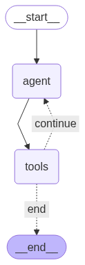

### Langgraph Tutorial By FreeCodeCamp implementation and testing.

<h1 style="color:green">Summary of what I learned from to this point from graph_1 to graph_3</h1>


<h1 style="color:green">Summary of my design notes from Agent_1 to Agent_4</h1>

* Design the graph using an external tool like excalidraw before starting the implementation; it will help you to visualize the flow of the Agent, the relationship between the nodes and how to pass the data between them.
* Design the state shape and definitions before starting the implementation

<h1 style="color:green">Tracking the life cycle of the state for Agent_4</h1>


#### Step 0: Initialization

*   **Node:** None (before graph execution starts).
*   **Action:** The `run_document_agent` function is called.
*   **Initial State:** `state = {"messages": []}`

---
#### Step 1: First Entry into the `agent` Node

*   **Node:** `agent`
*   **State *Before* Node:** `{"messages": []}`
*   **What Happens Inside the Node:**
    1.  The `our_agent` function receives the state.
    2.  The condition `if not state["messages"]:` is **true**.
    3.  A predefined `user_input` is created: `"I'm ready to help you update a document. What would you like to create?"`. This is wrapped in a `HumanMessage`.
    4.  The LLM is called with a `SystemMessage` and this initial `HumanMessage`. Let's assume the LLM responds with a greeting like: `AIMessage(content="Hello! I am Drafter. What should be the first line of your document?")`.
    5.  The node returns a new dictionary containing the messages to be *added* to the state: `{"messages": [HumanMessage(...), AIMessage(...)]}`.
*   **State *After* Node (thanks to `add_messages`):**
    ```
    {
        "messages": [
            HumanMessage(content="I'm ready to help..."),
            AIMessage(content="Hello! I am Drafter...")
        ]
    }
    ```

---

#### Step 2: First Entry into the `tools` Node

*   **Node:** `tools`
*   **State *Before* Node:** Same as "State After" from Step 1.
*   **What Happens Inside the Node:**
    1.  The `ToolNode` inspects the most recent message, which is the `AIMessage` from the `agent`.
    2.  It checks if this `AIMessage` contains any `tool_calls`. In this case, it does not.
    3.  The node does nothing and passes the state through unchanged.
*   **State *After* Node:** The state remains identical.

---

#### Step 3: First Entry into the `should_continue` Conditional Edge

*   **Node:** `should_continue` (this is an edge, not a node, but it functions like one)
*   **State *Before* Edge:** Same as "State After" from Step 2.
*   **What Happens Inside the Function:**
    1.  The function checks the list of messages.
    2.  It looks for a `ToolMessage` indicating the `save` tool was used. It finds none.
    3.  It returns the string `"continue"`.
*   **Routing Decision:** The graph follows the "continue" path, which leads back to the `agent` node.

---

#### Step 4: Second Entry into the `agent` Node

*   **Node:** `agent`
*   **State *Before* Node:** The state contains the first `HumanMessage` and `AIMessage`.
*   **What Happens Inside the Node:**
    1.  The condition `if not state["messages"]:` is now **false**.
    2.  The `else` block runs, and the program pauses at `input(...)`, waiting for the user.
    3.  **User types:** `Let's write: "Hello LangGraph!"`
    4.  A new `HumanMessage(content='Let\'s write: "Hello LangGraph!"')` is created.
    5.  The LLM is called with the full history: `SystemMessage`, the first `Human/AI` pair, and the new `HumanMessage`.
    6.  The LLM understands the instruction and that the current document is empty. It decides to use the `update` tool. It returns an `AIMessage` with a tool call: `AIMessage(content="", tool_calls=[{'name': 'update', 'args': {'content': 'Hello LangGraph!'}, 'id': '...'}])`.
    7.  The node returns the new `HumanMessage` and the `AIMessage` with the tool call.
*   **State *After* Node:**
    ```
    {
        "messages": [
            HumanMessage(content="I'm ready to help..."),
            AIMessage(content="Hello! I am Drafter..."),
            HumanMessage(content='Let\'s write: "Hello LangGraph!"'),
            AIMessage(content="", tool_calls=[...])
        ]
    }
    ```

---

#### Step 5: Second Entry into the `tools` Node

*   **Node:** `tools`
*   **State *Before* Node:** Same as "State After" from Step 4.
*   **What Happens Inside the Node:**
    1.  The `ToolNode` inspects the latest `AIMessage` and finds the `tool_calls` for the `update` tool.
    2.  It executes the `update(content="Hello LangGraph!")` function.
    3.  This function updates the **global variable** `document_content` to `"Hello LangGraph!"` and returns the string `"Document has been updated successfully!..."`.
    4.  The `ToolNode` wraps this result in a `ToolMessage`.
*   **State *After* Node:** A `ToolMessage` is appended.
    ```
    {
        "messages": [
            ..., // previous 4 messages
            ToolMessage(content="Document has been updated successfully!...", tool_call_id='...')
        ]
    }
    ```

---

#### Step 6: Second Entry into the `should_continue` Edge

*   **Node:** `should_continue`
*   **State *Before* Edge:** Same as "State After" from Step 5.
*   **What Happens Inside the Function:**
    1.  It inspects the messages, starting from the newest one (`ToolMessage`).
    2.  It checks if this message is from the `save` tool. It is not.
    3.  It returns `"continue"`.
*   **Routing Decision:** The graph loops back to the `agent` node again.

This loop (`agent` -> `tools` -> `should_continue` -> `agent`) will continue until the user asks to save. Let's fast-forward to that point.

---

#### Step 7: Final `agent` and `tools` Interaction

*   **Node:** `agent`
*   **Action:** The user types `Save it as hello.txt`. The LLM, seeing the history and the document content (injected via the System Prompt), generates an `AIMessage` with a `tool_calls` for `save(filename='hello.txt')`. The state is updated with this new `HumanMessage` and `AIMessage`.
*   **Node:** `tools`
*   **Action:** The `ToolNode` executes the `save` tool. The file `hello.txt` is created on disk. The tool returns a success message like `"Document has been saved successfully to 'hello.txt'."`. This is wrapped in a `ToolMessage` and appended to the state.
*   **State *After* `tools` Node:** The `messages` list now ends with:
    ```
    ...
    HumanMessage(content="Save it as hello.txt"),
    AIMessage(content="", tool_calls=[{'name': 'save', ...}]),
    ToolMessage(content="Document has been saved successfully to 'hello.txt'.")
    ...
    ```

---

#### Step 8: Final `should_continue` Edge

*   **Node:** `should_continue`
*   **State *Before* Edge:** The state from the previous step.
*   **What Happens Inside the Function:**
    1.  The function inspects the messages, starting from the newest one.
    2.  The newest message is `ToolMessage(content="Document has been saved...")`.
    3.  The condition `isinstance(message, ToolMessage) and "saved" in message.content.lower()` is now **true**.
    4.  It returns the string `"end"`.
*   **Routing Decision:** The graph follows the "end" path, which leads to the special `END` state, terminating the graph's execution.


